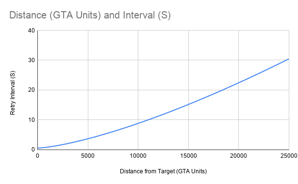

# Fivem 3D Text

A Javascript based package for 3D text helpers roughly based on the Lua package [motiontext](https://github.com/ThatZiv/motiontext). The primary functionality is to display 3D text to the player when they are within range of a set of coordinates.


Created based on [fivem-ts-boilerplate](https://github.com/d0p3t/fivem-ts-boilerplate) repo.

# Improvements over other 3D text packages

In addition to the functions implemented this package implements a distance base interval retry so that the client does not needlessly perform the distance logic over and over. It will instead try to update the retry interval based on the distance from the text coordinates. This should result in better performance by **only checking distance frequently when the player is close to the text coordinates** and otherwise increasing the retry interval when we are further away.

Plot of distance vs. interval [(source)](https://docs.google.com/spreadsheets/d/1t_7QG1YB0XhuyBDTrLYqZNL4z7LfUN0HZoCKPKf-WSY/edit#gid=2147061935):



There may be some edge cases with very large or very small radii in which this has unexpected results.

# Installation

## Node
The preferred method is to use a standard JavaScript or TypeScript environment and install with `npm`:

`npm install --save fivem-3d-text`

## fivem 

If you are using Lua or C# you can utilize this package through the [`exports`](https://docs.fivem.net/docs/scripting-reference/runtimes/javascript/functions/exports/) object to utilize them. To "install" in this method just clone this repository into your `server-data` folder and add `fivem-3d-text` to your server configuration.
# Usage

There are two primary function:

[`draw3DTextPermanent`](https://github.com/erik-sn/fivem-3d-text/blob/master/docs/modules.md#draw3dtextpermanent) - draws text that will be visible as long as the player is in range.

[`draw3DTextTimeout`](https://github.com/erik-sn/fivem-3d-text/blob/master/docs/modules.md#draw3dtexttimeout) - draws text that will dissapear after the specified timeout.

Check [the configuration options here](https://github.com/erik-sn/fivem-3d-text/blob/master/docs/interfaces/config.md#properties) and [the full documentation here](./docs/modules.md).
## Examples:

### Node

```
import { draw3DTextPermanent } from 'fivem-3d-text'

async function testDraw() {
  const config = {
    x: -1377.514282266, // at the airport
    y: -2852.64941406,
    z: 13.9448,
    text: 'Test',
    radius: 15,
  }
  draw3DTextPermanent(config);
}

RegisterCommand('draw', testDraw, false);
```

### exports

If using the [`exports`](https://docs.fivem.net/docs/scripting-reference/runtimes/javascript/functions/exports/) object:

```
exports.motiontext:Draw3DTextPermanent(...configuration)
```

# Development

Prerequisites for development are [node LTS](https://nodejs.org/en/about/releases/) and a [working fivem server](https://docs.fivem.net/docs/server-manual/setting-up-a-server/) locally.

Clone this repository into your server location and add `fivem-3d-text` to your server configuration. To watch the code and reload file changes run `npm run watch`.

To build the final package with optimizations run `npm run build`.

# Resource Usage

Below is a comparison of resource usage in cases with 1, 10, and 100 instances of 3D text active.
## Baseline with no 3D texts created


## One instance of 3D text

With one text resource usage appears relatively small. `fivem-3d-text` is somewhat larger while text is visible, this seems to be normal for [JavaScript based resources](https://forum.cfx.re/t/lua-vs-javascript/1210007/2).
### Visible


### Out of range


## 10 Instances of 3D text

With 10 instances of permanent text active and out of range we're pretty even. Especially as we move further away from the markers.

### Just out of range


### Very far out of range


## 100 instances of 3D text

With 100 instances distance starts to matter. `fivem-3d-text`'s interval seems to add a lot of improvement.

### Not too far out of range


### Very far out of range

This is the ideal case for `fivem-3d-text` and where it performs the best against. This use case more or less represents a server where there are many interactables (doors, npcs, etc.) that are waiting to be within range of the use.


